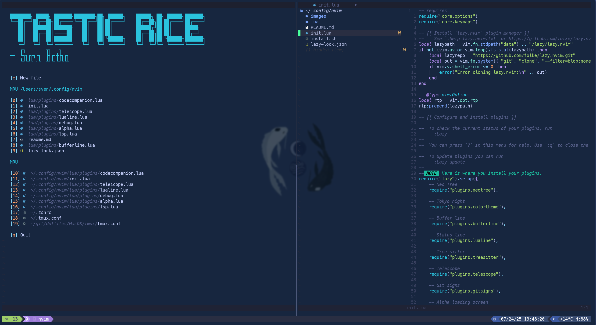

# 🍚 Tastic Rice - Neovim Configuration

A deliciously configured Neovim setup that transforms your editor into a powerful IDE experience. Tastic Rice combines modern plugins with sensible defaults to create a productive development environment.



## ✨ Features

- **🚀 Modern Plugin Management**: Powered by [lazy.nvim](https://github.com/folke/lazy.nvim)
- **🎨 Beautiful UI**: Custom dashboard with Alpha, sleek bufferline, and statusline
- **🔍 Fuzzy Finding**: Telescope integration for files, grep, and more
- **🌳 File Explorer**: Neo-tree for intuitive file navigation
- **💡 LSP Support**: Full Language Server Protocol integration
- **🐛 Debugging**: Built-in debugging capabilities
- **🎯 Auto-completion**: Smart completion with nvim-cmp
- **🎨 Syntax Highlighting**: Advanced syntax highlighting with Treesitter
- **📝 Code Formatting**: Integrated formatting and linting with none-ls
- **🔄 Git Integration**: GitSigns and LazyGit for seamless version control
- **🤖 AI Assistant**: Code Companion for AI-powered coding assistance

## 📦 Included Plugins

### Core Functionality
- **lazy.nvim** - Plugin manager
- **telescope.nvim** - Fuzzy finder
- **neo-tree.nvim** - File explorer
- **treesitter** - Syntax highlighting
- **nvim-lspconfig** - LSP configuration
- **nvim-cmp** - Auto-completion

### UI Enhancement
- **alpha-nvim** - Custom dashboard
- **bufferline.nvim** - Buffer tabs
- **lualine.nvim** - Status line
- **indent-blankline.nvim** - Indentation guides

### Development Tools
- **nvim-dap** - Debug Adapter Protocol
- **none-ls.nvim** - Formatting and linting
- **gitsigns.nvim** - Git integration
- **lazygit.nvim** - Git UI
- **codecompanion.nvim** - AI coding assistant

## 🚀 Quick Start

### Prerequisites

- **Neovim** >= 0.9.0
- **Git**
- **Node.js** (for some LSP servers)
- **A Nerd Font** (recommended: [JetBrainsMono Nerd Font](https://www.nerdfonts.com/))

### Installation

1. **Clone or download** this repository
2. **Run the install script**:
   ```bash
   chmod +x install.sh
   ./install.sh
   ```
3. **Launch Neovim**:
   ```bash
   nvim
   ```
4. **Wait for plugins to install** - Lazy.nvim will automatically download and install all plugins on first run

### Manual Installation

If you prefer manual installation:

```bash
# Backup existing config (if any)
mv ~/.config/nvim ~/.config/nvim.backup

# Create config directory
mkdir -p ~/.config/nvim

# Copy configuration files
cp -r lua/ ~/.config/nvim/
cp init.lua ~/.config/nvim/
cp lazy-lock.json ~/.config/nvim/
```

## 📁 Project Structure

```
~/.config/nvim/
├── init.lua                 # Main configuration entry point
├── lazy-lock.json          # Plugin version lockfile
└── lua/
    ├── core/
    │   ├── options.lua      # Neovim options and settings
    │   └── keymaps.lua      # Key bindings and shortcuts
    └── plugins/
        ├── alpha.lua        # Dashboard configuration
        ├── autocompletion.lua  # Completion setup
        ├── bufferline.lua   # Buffer tabs
        ├── codecompanion.lua   # AI assistant
        ├── colortheme.lua   # Color scheme
        ├── debug.lua        # Debugging setup
        ├── gitsigns.lua     # Git integration
        ├── indent-blankline.lua  # Indentation guides
        ├── lazygit.lua      # Git UI
        ├── lsp.lua          # Language servers
        ├── lualine.lua      # Status line
        ├── misc.lua         # Miscellaneous plugins
        ├── neotree.lua      # File explorer
        ├── none-ls.lua      # Formatting and linting
        ├── telescope.lua    # Fuzzy finder
        └── treesitter.lua   # Syntax highlighting
```

## ⌨️ Key Bindings

### General
- `<leader>` = `Space`
- `<leader>ff` - Find files
- `<leader>fg` - Live grep
- `<leader>fb` - Find buffers
- `<leader>fh` - Help tags

### File Navigation
- `<leader>e` - Toggle file explorer
- `<C-h/j/k/l>` - Navigate splits
- `<leader>bd` - Close buffer

### Git
- `<leader>gg` - Open LazyGit
- `]c` / `[c` - Next/previous git hunk

### LSP
- `gd` - Go to definition
- `gr` - Go to references
- `K` - Hover documentation
- `<leader>ca` - Code actions

*For a complete list of keybindings, see `lua/core/keymaps.lua`*

## 🎨 Screenshots

### Dashboard


### Code Editing


### File Explorer


### Telescope Finder


### Git Integration


## 🛠️ Customization

### Adding New Plugins

Create a new file in `lua/plugins/` or add to an existing file:

```lua
return {
  "author/plugin-name",
  config = function()
    -- Plugin configuration
  end
}
```

### Modifying Keybindings

Edit `lua/core/keymaps.lua` to add or modify key bindings.

### Changing Color Scheme

Edit `lua/plugins/colortheme.lua` to use a different theme.

## 🔧 Troubleshooting

### Common Issues

1. **Plugins not loading**: Run `:Lazy sync` in Neovim
2. **LSP not working**: Install language servers with `:Mason`
3. **Icons not showing**: Install a Nerd Font and configure your terminal

### Getting Help

- Check `:checkhealth` in Neovim for diagnostics
- Review plugin documentation: `:help <plugin-name>`
- Check the lazy.nvim status: `:Lazy`

## 🤝 Contributing

Feel free to fork this configuration and make it your own! If you have improvements or bug fixes, pull requests are welcome.

## 📄 License

This configuration is provided as-is for educational and personal use.

## 🙏 Acknowledgments

- [lazy.nvim](https://github.com/folke/lazy.nvim) - Amazing plugin manager
- [Neovim](https://neovim.io/) - The editor that makes it all possible
- All the plugin authors who create these fantastic tools

---

**Happy coding with Tastic Rice! 🍚✨**